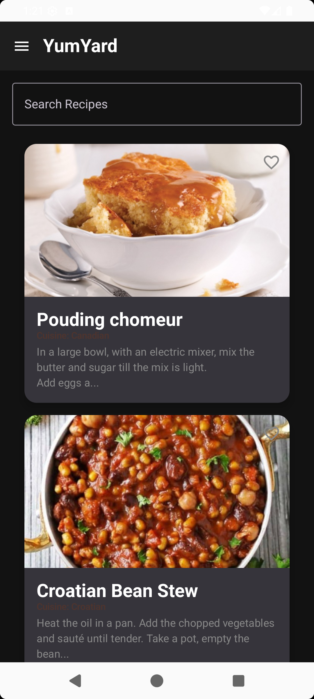
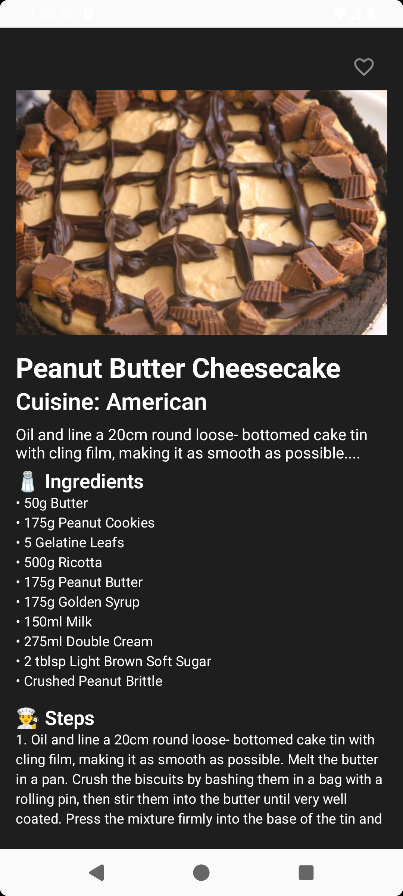

🍲 YumYard – Recipe Discovery App

YumYard is a modern Android recipe app built with best practices, offering:
✅ Seamless cooking experience
✅ Offline access
✅ Real-time updates
✅ Personalized recommendations
✅ Community-driven recipe sharing

📥 Download
📱 APK	🌐 Play Store
Download APK
	Google Play Store
✨ Features
Feature	Description
🔎 Browse & Search	Discover thousands of recipes with images, ingredients & step-by-step instructions
🍴 Filter Recipes	Search by cuisine, dietary restrictions, or cooking time
⭐ Save Favorites	Bookmark recipes for quick access (Room Database)
📶 Offline Mode	Access saved recipes without internet connection
👤 User Profiles	Sign in with Firebase Auth to sync favorites across devices
🔄 Real-Time Updates	Recipes always stay fresh with Firestore cloud sync
➕ Community Recipes	Users can add & share their own recipes
💰 Ad Integration	Monetized using Google AdMob (Banner & Interstitial Ads)
📩 Push Notifications	Trending recipes via Firebase Cloud Messaging (FCM)
🌙 Dark Mode	Seamless light/dark theme switching with Compose
🛠 Tech Stack
Layer	Technology
Language	Kotlin
UI	Jetpack Compose
Architecture	MVVM + Clean Architecture
Dependency Injection	Hilt (Dagger)
Networking	Retrofit + Gson
Local Storage	Room Database
Authentication	Firebase Auth
Cloud Database	Firestore
Analytics	Firebase Analytics + Crashlytics
Async Handling	Kotlin Coroutines + Flow
Images	Coil (Image Loading)
Ads	Google AdMob (Banner + Interstitial)
📸 Screenshots

    

🚀 Getting Started
# Clone the repository
git clone https://github.com/your-username/YumYard.git

# Open in Android Studio
# Add your google-services.json (for Firebase)
# Add AdMob keys in local.properties (not public!)
# Run the app 🚀

💡 Future Improvements
Planned Feature	Description
🎙️ Advanced Search	Voice-powered search for faster discovery
🤖 Personalized Recommendations	AI/ML-driven recipe suggestions
🧑‍🍳 Meal Planner	Weekly meal planning with shopping lists
🌍 Localization	Multi-language support
🤝 Contributing

Contributions, issues, and feature requests are welcome!
Feel free to fork the repo and submit a PR 🚀
