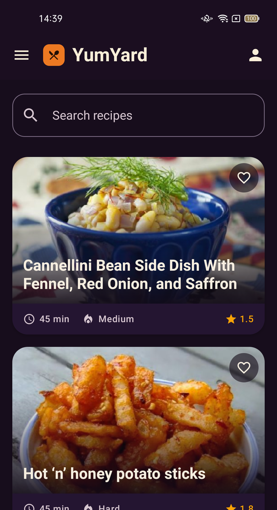
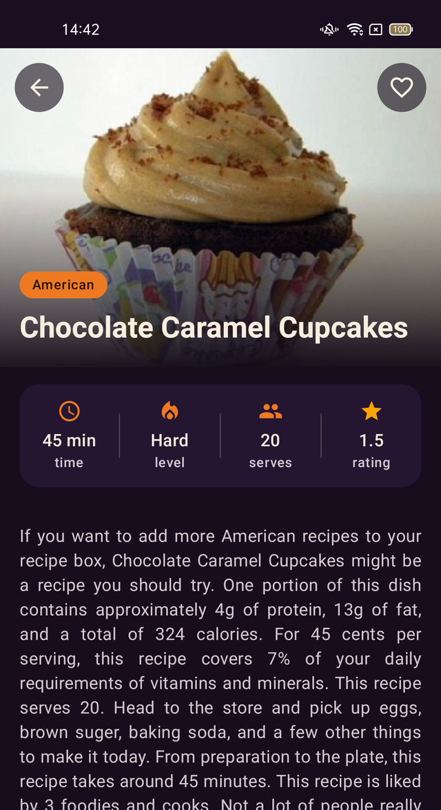
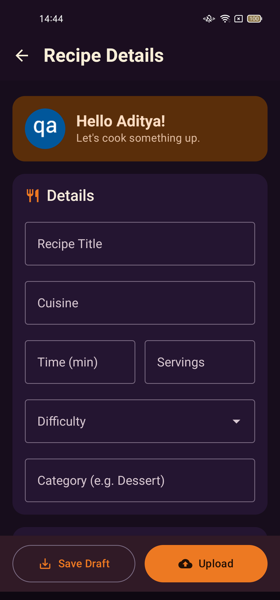
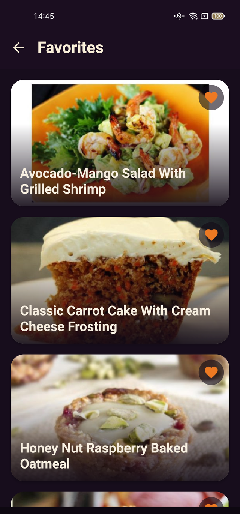

# 🍲 YumYard – Recipe Discovery App

YumYard is a modern Android recipe app built with Jetpack Compose and a Firestore-powered backend, offering:
✅ Beautifully redesigned, brand-themed UI
✅ Hundreds of curated recipes + community uploads
✅ Offline-first favorites synced to your account
✅ Create, upload & manage your own recipes
✅ Forced in-app updates so everyone stays current

---

## 📥 Download

| Type | Link |
|------|------|
| 📱 APK | [Download APK](apk/app-release.apk) |
| 🌐 Play Store | [Google Play Store](https://play.google.com/store/apps/details?id=com.keysersoze.yumyard) |

---

## ✨ Features

| Feature | Description |
|---------|-------------|
| 🔎 Browse & Search | Discover curated recipes with images, ingredients & step-by-step instructions; search by title (catalog + community) |
| 📋 Rich Recipe Details | Cook time, servings, difficulty, category, cuisine, ingredients & numbered steps |
| ⭐ Save Favorites | Per-user favorites stored in Firestore, offline-first and synced across devices |
| ➕ Add & Upload Recipes | Publish your own recipes with photo, ingredients, steps, time, servings, difficulty & category |
| 📚 My Recipes | Manage everything you've published in one place |
| 🌐 Community Recipes | Explore unique recipes uploaded by fellow home chefs |
| 👤 Google Sign-In | Firebase Authentication with Google |
| ⬆️ Forced In-App Updates | Google Play In-App Updates gate old versions with a branded update screen |
| 💰 Ad Integration | Monetized with Google AdMob (Banner & Interstitial) |
| 📩 Push Notifications | Firebase Cloud Messaging (FCM) |
| 🌙 Adaptive Theme | Logo-derived Material 3 light/dark theme that follows the system setting |

---

## 🛠 Tech Stack

| Layer | Technology |
|-------|------------|
| Language | Kotlin 2.2.20 |
| UI | Jetpack Compose (Material 3) |
| Architecture | MVVM + Clean Architecture |
| Dependency Injection | Hilt 2.60.1 |
| Data Source | Cloud Firestore (recipe catalog + user recipes) |
| Local Storage | Room (recipe drafts) + DataStore (cache & preferences) |
| Authentication | Firebase Auth (Google Sign-In) |
| Media Storage | Firebase Storage (recipe images) |
| Messaging | Firebase Cloud Messaging |
| Analytics | Firebase Analytics + Crashlytics |
| In-App Updates | Google Play Core (app-update) |
| Async Handling | Kotlin Coroutines + Flow |
| Images | Coil |
| Ads | Google AdMob (Banner + Interstitial) |
| Build | AGP 9.3 · Gradle 9.5 · compileSdk 37 · minSdk 24 · JDK 17 |

---

## 📸 Screenshots

| Home | Recipe Details | Add Recipe | Favorites |
|------|----------------|-----------|-----------|
|  |  |  |  |

---

## 🚀 Getting Started

```bash
# Clone the repository
git clone https://github.com/keyserSoze98/YumYard.git
```

Then, in Android Studio:

1. Open the project (requires **JDK 17** and an AGP 9-compatible Android Studio).
2. Add your **`google-services.json`** to `app/` (for Firebase).
3. Add your keys to **`local.properties`** (kept out of version control):
   ```properties
   AD_APP_ID=ca-app-pub-xxxxxxxx~yyyyyyyy
   BANNER_AD_UNIT_ID=ca-app-pub-xxxxxxxx/zzzzzzzz
   INTERSTITIAL_AD_UNIT_ID=ca-app-pub-xxxxxxxx/wwwwwwww
   ```
4. Run the app 🚀 (debug builds show AdMob **test** ads by design).

---

## 💡 Future Improvements

| Planned Feature | Description |
|-----------------|-------------|
| ✏️ Edit Published Recipes | Reload a published recipe into the editor and overwrite it |
| 🗂️ Category & Cuisine Browse | Dedicated browse UI (Firestore already stores category/cuisine) |
| 🔐 More Sign-In Options | Email/Password and Phone (OTP) |
| 📦 R8 / ProGuard | Code shrinking, obfuscation & log stripping for release |

---

## 🤝 Contributing

Contributions, issues, and feature requests are welcome!
Feel free to fork the repo and submit a PR 🚀
