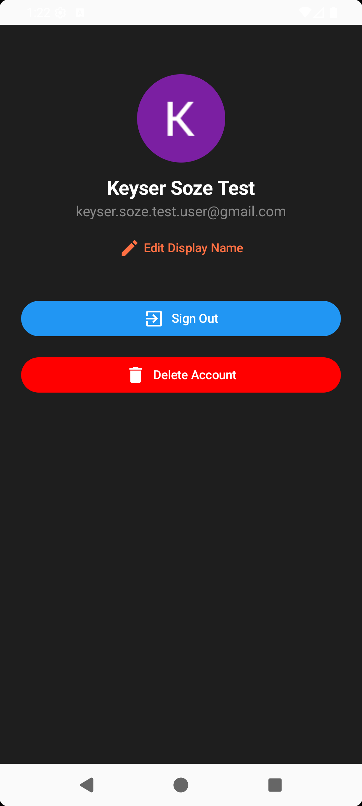

# 🍲 YumYard – Recipe Discovery App

YumYard is a modern Android recipe app built with best practices, offering:  
✅ Seamless cooking experience  
✅ Offline access  
✅ Real-time updates  
✅ Personalized recommendations  
✅ Community-driven recipe sharing  

---

## 📥 Download

| Type | Link |
|------|------|
| 📱 APK | [Download APK](apk/YumYard-v2.0.0.apk) |
| 🌐 Play Store | [Google Play Store](https://play.google.com/store/apps/details?id=com.keysersoze.yumyard) |

---

## ✨ Features

| Feature | Description |
|---------|-------------|
| 🔎 Browse & Search | Discover thousands of recipes with images, ingredients & step-by-step instructions |
| 🍴 Filter Recipes | Search by cuisine, dietary restrictions, or cooking time |
| ⭐ Save Favorites | Bookmark recipes for quick access (Room Database) |
| 📶 Offline Mode | Access saved recipes without internet connection |
| 👤 User Profiles | Sign in with Firebase Auth to sync favorites across devices |
| 🔄 Real-Time Updates | Recipes always stay fresh with Firestore cloud sync |
| ➕ Community Recipes | Users can add & share their own recipes |
| 💰 Ad Integration | Monetized using Google AdMob (Banner & Interstitial Ads) |
| 📩 Push Notifications | Trending recipes via Firebase Cloud Messaging (FCM) |
| 🌙 Dark Mode | Seamless light/dark theme switching with Compose |

---

## 🛠 Tech Stack

| Layer | Technology |
|-------|------------|
| Language | Kotlin |
| UI | Jetpack Compose |
| Architecture | MVVM + Clean Architecture |
| Dependency Injection | Hilt (Dagger) |
| Networking | Retrofit + Gson |
| Local Storage | Room Database |
| Authentication | Firebase Auth |
| Cloud Database | Firestore |
| Analytics | Firebase Analytics + Crashlytics |
| Async Handling | Kotlin Coroutines + Flow |
| Images | Coil (Image Loading) |
| Ads | Google AdMob (Banner + Interstitial) |

---

## 📸 Screenshots

| Home | Profile | Details |
|------|--------|---------|
|  |  |  |

---

## 🚀 Getting Started

```bash
# Clone the repository
git clone https://github.com/keyserSoze98/YumYard.git

# Open in Android Studio
# Add your google-services.json (for Firebase)
# Add AdMob keys in local.properties (not public!)
# Run the app 🚀
💡 Future Improvements
Planned Feature	Description
🎙️ Advanced Search	Voice-powered search for faster discovery
🤖 Personalized Recommendations	AI/ML-driven recipe suggestions
🧑‍🍳 Meal Planner	Weekly meal planning with shopping lists
🌍 Localization	Multi-language support

🤝 Contributing
Contributions, issues, and feature requests are welcome!
Feel free to fork the repo and submit a PR 🚀
